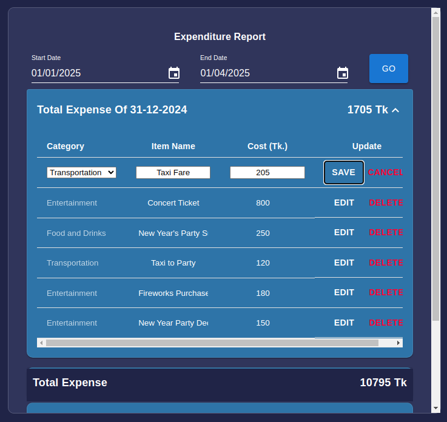

# Expense Tracker App


## Live Link
[Live link](https://expense-tracker-app-frontend-skst.onrender.com)

## API Documentation

[API Documentation Link](https://expense-tracker-app-backend-i7w6.onrender.com/api-docs/)

---

## Features

### 1. Easy UI for Adding Funds
A streamlined and intuitive interface designed for quick and hassle-free addition of funds. Users can add funds with just a few clicks, ensuring a seamless user experience.

---

### 2. Forecasting Future Expenses from Historical Data
Leverage data-driven insights to predict your future expenses based on past trends. This feature uses statistical algorithms to provide you with an estimate of upcoming expenditures, helping you plan better.


---

### 3. Managing Recent Expenses with Updates
Track your recent expenses and make real-time updates. Modify entries, adjust amounts, or delete outdated records with ease to keep your data accurate and up-to-date.


---

### 4. Managing Reports from Date Range
Generate detailed reports for a specific date range. Reports include:
- **Pie Charts**: Visualize your expense distribution.
- **Expense Lists**: Access itemized lists for transparency and detailed tracking.


| Recenet Expense Management | Specified expenses from date range | 
|-----------|--------------|
| | |

---

### 5. Material Design
The app leverages Material Design principles to provide a sleek, modern, and user-friendly interface. The design ensures consistency, responsiveness, and accessibility across devices.


---

## Installation and Setup

1. Clone the repository:
   ```bash
   git clone https://github.com/yourusername/expense-tracker.git
   ```

2. Navigate to the project directory:
   ```bash
   cd expense-tracker
   ```

3. Install dependencies for frontend:
   ```bash
   cd frontend
   npm install
   ```
3. Install dependencies for backend:
  ```bash
  cd backend
  npm install
  ```

4. Start the application:
   backend
   ```bash
   npm start
   ```
   frontend
   ```bash
   npm run dev
   ```

---

## Technology Stack

- **Frontend**: React with Material-UI
- **Backend**: Node.js with Express
- **Database**: MongoDB
- **APIs**: RESTful APIs with Axios integration

---

## Contribution

Feel free to fork the repository and contribute to improving this project. Pull requests are welcome!

---

## License

This project is licensed under the MIT License. See the LICENSE file for details.

